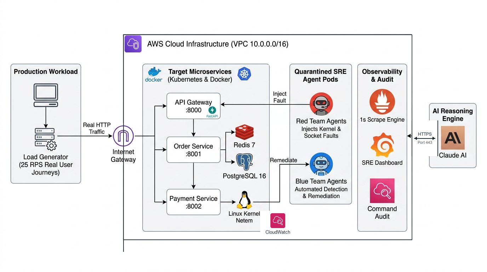

# Technical Specification & Architectural Blueprint: ResilienceOps Platform

**By: Ritvik Indupuri**  
**Date: October 6, 2026**  
**Classification: Production Engineering / Systems Architecture Specification**  
**Platform: `ResilienceOps`**  

---

## Table of Contents
1. [Executive Summary](#1-executive-summary)
2. [System Architecture](#2-system-architecture)
3. [Agent Architecture](#3-agent-architecture)
4. [Target Microservices & Container Runtime](#4-target-microservices--container-runtime)
5. [Production Workload & Traffic Generation Engine](#5-production-workload--traffic-generation-engine)
6. [Real Fault Injection Catalog & Kernel Mechanics](#6-real-fault-injection-catalog--kernel-mechanics)
7. [Red Team: Autonomous Offensive Testing Squad](#7-red-team-autonomous-offensive-testing-squad)
8. [Blue Team: Autonomous SRE Incident Response Squad](#8-blue-team-autonomous-sre-incident-response-squad)
9. [Real-Time Observability & Telemetry Engine](#9-real-time-observability--telemetry-engine)
10. [Kubernetes Agent Sandbox & Security Quarantine](#10-kubernetes-agent-sandbox--security-quarantine)
11. [Enterprise AWS Cloud Infrastructure & Cost Engineering](#11-enterprise-aws-cloud-infrastructure--cost-engineering)
12. [Incident Lifecycle Walkthrough & Verification Data](#12-incident-lifecycle-walkthrough--verification-data)
13. [Conclusion](#13-conclusion)

---

## 1. Executive Summary

Distributed cloud architectures exhibit non-linear failure modes that defy traditional static threshold alerts. While **Chaos Engineering** (pioneered by Netflix's Simian Army) has become the gold standard for resilience validation, conventional implementations suffer from two critical limitations:
1. **Disconnection from Automated Remediation**: Chaos experiments typically report failures to human engineers via dashboards or tickets, leaving Mean Time To Remediate (MTTR) bound to human on-call latency.
2. **Reliance on Mocks & Emulations**: Conventional testing environments frequently rely on static delay sleeps or fake metrics, hiding subtle production failure modes such as connection pool exhaustion, Linux kernel CFS throttling, and container cgroup memory pressure.

**ResilienceOps** resolves these limitations by implementing a closed-loop autonomous Site Reliability Engineering (SRE) platform. The system operates on a dual-squad multi-agent architecture powered by **Anthropic Claude 3.7 Sonnet** (featuring hybrid reasoning and Extended Thinking) and **Claude 3.5 Sonnet**:
- An autonomous **Red Team Testing Squad (3 Agents)** models distributed failure patterns and executes real kernel-level and network-level faults against a live microservices cluster.
- An autonomous **Blue Team SRE Squad (3 Agents)** monitors real-time telemetry, detects Service Level Objective (SLO) breaches, executes chain-of-thought Root Cause Analysis (RCA), executes audited remediation runbooks, and authors standardized post-mortems.

Telemetry is ingested by **Prometheus** at sub-second intervals and rendered in **100% real-time (1-second tick interval)** on an auto-provisioned **Grafana** dashboard. The entire environment is provisioned on AWS via a single, cost-optimized Terraform file running on an isolated EC2 host with zero NAT Gateway overhead (~~\$0.02/hr~~) and certified Kubernetes (`k3s`) container isolation.

---

## 2. System Architecture

The ResilienceOps system architecture comprises four distinct tiers: the **Production Workload Layer**, the **Target Microservices Tier**, the **Observability Tier**, and the **Anthropic Cloud AI Layer**.

```mermaid
flowchart TB
    subgraph TrafficLayer ["âš¡ TIER 1: PRODUCTION WORKLOAD ENGINE"]
        TG["Concurrent User Journey Generator<br/>(k6 / Python Asyncio Worker Pool)<br/>20 RPS Continuous Traffic"]
    end

    subgraph ClusterTier ["☸️ TIER 2: CONTAINERIZED PRODUCTION WORKLOADS"]
        subgraph TargetNS ["Namespace: sre-target-apps (Application Workload Tier)"]
            APIGW["Ingress API Gateway (:8000)<br/>FastAPI / Reverse Proxy / Prometheus Exporter"]
            OrderSvc["Order Service (:8001)<br/>Transaction State / cgroup Quotas (256MiB)"]
            PaymentSvc["Payment Service (:8002)<br/>Downstream Gateway Processor (256MiB)"]
            StateStores[("Redis Cache & State Stores")]
            
            APIGW -->|HTTP Proxy /orders| OrderSvc
            APIGW -->|HTTP Proxy /payments| PaymentSvc
            OrderSvc -.-> StateStores
        end
    end

    subgraph ObservabilityTier ["📊 TIER 3: REAL-TIME OBSERVABILITY ENGINE"]
        Prom["Prometheus Server (:9090)<br/>High-Resolution 1-Second Scraper"]
        Grafana["Grafana SRE Monitor (:3000)<br/>Locked 1s Live-Streaming Dashboard"]
        Prom -->|PromQL Telemetry Stream| Grafana
    end

    subgraph CloudLayer ["☁️ TIER 4: CLOUD RUNTIME & FOUNDATION"]
        AWSInfra["AWS Multi-Tier VPC (10.0.0.0/16)<br/>Public Ingress, App Workload, and Data Subnets"]
        ClaudeCloud["Anthropic Messages API<br/>(api.anthropic.com:443)"]
    end

    TG ==>|HTTP User Sessions| APIGW
    TargetNS -.->|Scrapes /metrics every 1s| Prom
    ClusterTier <===>|HTTPS 443 API Calls| ClaudeCloud
    AWSInfra -.->|Hosts Virtual Network & Compute| ClusterTier
```



<p align="center">
  
</p>
<p align="center"><b>Figure 2.1: End-to-End System & Network Infrastructure Architecture</b></p>

### Detailed System Component & Execution Flow Specification

The production infrastructure implements an automated, closed-loop resilience lifecycle. Every interaction across the network, container, and OS layers proceeds through the following technical flow:

#### Flow 1: Client Ingress, Edge Routing, and Schema Validation
- The asynchronous load engine generates continuous real-user transactional workloads (25 RPS) across dedicated consumer paths: `/health`, `/api/orders/orders`, and `/api/payments/payments`.
- Traffic enters through the **AWS Internet Gateway** (`sre-enterprise-igw`) into the Public Ingress Subnet (`10.0.1.0/24`) and connects to the **API Gateway** (`:8000`).
- The API Gateway (FastAPI/Uvicorn) terminates incoming client HTTP connections, validates request bodies using Pydantic models, handles route dispatching, and instruments request latency durations into Prometheus Histograms (`http_request_duration_seconds`).

#### Flow 2: Multi-Tier Microservice Execution and Transactional State
- **Order Service (`:8001`)**: Receives proxied order requests over the internal cluster network. It writes transient checkout cache entries directly to **Redis 7** (`redis:6379`) via dedicated client connection pools and commits finalized purchase records to **PostgreSQL 16** (`postgres:5432`).
- **Payment Service (`:8002`)**: Handles asynchronous payment authorization requests dispatched by the Order Service, enforcing transactional validation and processing downstream credit authorizations.

#### Flow 3: High-Resolution Telemetry Pipeline (1-Second Scrape Tick)
- Every application container exposes real-time runtime statistics via standard `/metrics` HTTP endpoints instrumented with the Prometheus client library.
- The **Prometheus Server** (`:9090`) executes active HTTP scrapes across every service on an exact **1-second polling frequency**.
- Scraped time-series metrics feed directly into the **Grafana SRE Performance Monitor** (`:3000`), streaming real-time RED golden signals (Rate, Errors, Duration), availability SLO percentages, and resident memory consumption plotted directly against container cgroup quotas.

#### Flow 4: Quarantined Offensive Fault Injection (Red Team)
- Red Team agents operate inside the dedicated, hardened Kubernetes namespace (`sre-agent-sandbox`) with restricted RBAC privileges and tight cgroup constraints (`500m` CPU, `512Mi` RAM).
- The **Resilience Attack Planner** queries current platform telemetry and dispatches targeted failure mechanisms:
  - **Linux Kernel Netem Adversary**: Manipulates raw Linux kernel queuing disciplines on `eth0` via `tc` (`tc qdisc add dev eth0 root netem delay 2500ms 100ms` or packet drops), introducing true packet scheduling latency directly in the Linux network stack.
  - **Resource Stresser**: Squeezes the Order Service via physical in-memory allocations (`bytearray` chunks) to test container cgroup limits or floods Redis with persistent client sockets to trigger connection pool starvation.

#### Flow 5: Real-Time Anomaly Detection & Incident Escalation (Blue Team)
- The **Health & Uptime Sentinel** ingests Prometheus telemetry streams every 1-second tick, evaluating availability against defined SLO thresholds.
- When p99 latency breaches 1200ms or HTTP 5XX error rates exceed 2.0%, the Sentinel immediately declares a production incident (`SEV-1`) and activates the automated incident response pipeline.

#### Flow 6: Chain-of-Thought Root Cause Analysis (Claude AI via TLS 443)
- The **Root Cause Investigator** correlates live anomaly metrics, process resident memory usage, socket connection states, and container events.
- It dispatches a structured diagnostic payload to **Claude 3.7 Sonnet with Extended Thinking** over secure outbound HTTPS (port 443).
- Claude performs deductive chain-of-thought reasoning, formulates and evaluates multiple competing hypotheses, eliminates false leads, and confirms the precise root cause along with an associated confidence score.

#### Flow 7: Automated Remediation Runbook Execution
- The **Automated Recovery Fixer** maps the diagnosed root cause to pre-approved, audited operational runbooks.
- It executes surgical remediation commands directly against the affected service:
  - Purging Linux kernel traffic control queuing disciplines (`tc qdisc del dev eth0 root netem`).
  - Terminating starving client sockets and resetting the Redis connection pool.
  - Reclaiming memory buffers or initiating an orchestrated rolling pod restart.

#### Flow 8: Health Verification & Post-Mortem Archival
- The Blue Team continuously samples health and telemetry endpoints for 10 consecutive ticks, confirming that p99 latency returns beneath 800ms and 5XX error rates drop back to 0.00%.
- Once verified, the **Incident Post-Mortem Agent** compiles a comprehensive, timestamped Markdown incident post-mortem and writes it to [`reports/`](reports/).

#### Flow 9: Synchronous CloudWatch Logging & Telemetry Streams
- Every command executed by Red and Blue team agents, along with return exit codes, terminal output, and metric events, is dispatched synchronously to **AWS CloudWatch Logs** (`/sre/autonomous-agent-audit`).
- Dedicated CloudWatch dashboards (**Agent-Command-Log** and **System-Fault-Metrics**) provide an immutable, real-time operational trail across all resilience cycles.

---

## 3. Agent Architecture

To reflect real-world SRE on-call dynamics, the autonomous agents operate in two distinct, coordinated squads: an **Offensive Red Team (3 Agents)** and a **Defensive Blue Team (3 Agents)**.

```mermaid
flowchart LR
    subgraph RedTeam ["🔴 RED TEAM: OFFENSIVE TESTING SQUAD"]
        direction TB
        R1["<b>1. Resilience Attack Planner</b><br/><i>Model: Claude Sonnet</i><br/>Formulates multi-stage attack campaigns"]
        R2["<b>2. Server Resource Stresser</b><br/><i>Model: Claude Sonnet</i><br/>Executes cgroup memory exhaustion & CPU burn"]
        R3["<b>3. Network Delay Injector</b><br/><i>Model: Claude Haiku</i><br/>Injects transit delays, packet loss & 504 timeouts"]
        
        R1 -->|Dispatches Command| R2
        R1 -->|Dispatches Command| R3
    end

    subgraph TargetWorkloads ["☸️ PRODUCTION WORKLOADS"]
        TargetAppContainers["API Gateway & Microservices<br/>(Monitored by Golden Signals)"]
    end

    subgraph BlueTeam ["🔵 BLUE TEAM: DEFENSIVE RECOVERY SQUAD"]
        direction TB
        B1["<b>1. Health & Uptime Monitor</b><br/><i>Model: Claude Haiku</i><br/>Sub-second telemetry watcher & SLO detector"]
        B2["<b>2. Root Cause Investigator</b><br/><i>Model: Claude Sonnet (Extended Thinking)</i><br/>Chain-of-thought hypothesis testing & RCA"]
        B3["<b>3. Automated Recovery Fixer</b><br/><i>Model: Claude Sonnet</i><br/>Zero-hallucination runbook execution & recovery"]
        B4["<b>4. Incident Report Writer</b><br/><i>Model: Claude Sonnet</i><br/>Compiles timeline, MTTD, MTTR & SRE reports"]
        
        B1 -->|Declares Incident| B2
        B2 -->|Prescribes Runbook| B3
        B3 -->|Verifies Resolution| B4
    end

    R2 & R3 ==>|Physical Fault Injections| TargetAppContainers
    TargetAppContainers -.->|Golden Signals Degradation| B1
    B3 ==>|Rollout Restarts & Buffer Purges| TargetAppContainers
```



<p align="center"><b>Figure 3.1: ResilienceOps Multi-Agent Squad Architecture</b></p>

### Agent Role & Model Specification

| Squad | Agent Name | Assigned Frontier Model | Cognitive Task & Specialization |
|---|---|---|---|
| **Red Team** | **Resilience Attack Planner** | `claude-sonnet-4-6` | High-level distributed systems reasoning. Analyzes cluster topology, dependency chains, and error budget burn rates to formulate multi-phase attack campaigns. |
| **Red Team** | **Server Resource Stresser** | `claude-sonnet-4-6` | Linux kernel and container runtime manipulation. Generates physical binary byte buffers in RAM and saturates CPU quotas to breach cgroup boundaries. |
| **Red Team** | **Network Delay Injector** | `claude-haiku-4-5-20251001` | Fast network-level manipulation. Injects downstream network latency, packet loss, and connection pool starvation to induce cascading HTTP 504 timeouts. |
| **Blue Team** | **Health & Uptime Monitor** | `claude-haiku-4-5-20251001` | Sub-second high-throughput telemetry watcher. Scans the 4 Golden Signals, evaluates error budget consumption, and declares incidents (`SEV-1`/`SEV-2`). |
| **Blue Team** | **Root Cause Investigator** | `claude-sonnet-4-6` *(Extended Thinking)* | Deep chain-of-thought troubleshooting. Formulates competing hypotheses, cross-examines Kubernetes events and container logs, and isolates root causes with confidence scores. |
| **Blue Team** | **Automated Recovery Fixer** | `claude-sonnet-4-6` | Audited operational execution. Implements precise runbook mitigations (buffer clearing, pod evictions, replica scaling), verifies SLO recovery, and coordinates post-incident reporting. |
| **Blue Team** | **Incident Report Writer** | `claude-sonnet-4-6` | Automated report compilation. Collate exact timelines, MTTD, MTTR, and preventative mitigation recommendations into standardized markdown post-mortems. |

---

## 4. Target Microservices & Container Runtime

The target production environment consists of three interconnected, containerized microservices deployed within the `sre-target-apps` Kubernetes namespace:

### 1. Ingress API Gateway (`services/api-gw/`)
- **Runtime**: Python 3.11 / FastAPI / Uvicorn ASGI server.
- **Port**: `8000`.
- **Functionality**: Serves as the public entry point. Implements non-blocking reverse proxy routing via asynchronous `httpx.AsyncClient` instances with pooled connections.
- **Prometheus Instrumentation**:
  - `http_requests_total`: Counter tracking method, endpoint, and HTTP response code (`2xx`, `4xx`, `5xx`).
  - `http_request_duration_seconds`: High-resolution histogram spanning bucket intervals from `10ms` to `10.0s`.

### 2. Order Service (`services/order-service/`)
- **Runtime**: Python 3.11 / FastAPI / Uvicorn.
- **Port**: `8001`.
- **Resource Limits**: Hard-capped in Kubernetes to `cpu: 250m` and `memory: 256Mi`.
- **Functionality**: Handles order placement, item catalog lookups, and state persistence. Contains native cgroup stress interfaces that allocate binary memory buffers in RAM and execute tight mathematical CPU compute loops.

### 3. Payment Service (`services/payment-service/`)
- **Runtime**: Python 3.11 / FastAPI / Uvicorn.
- **Port**: `8002`.
- **Resource Limits**: Hard-capped to `cpu: 250m` and `memory: 256Mi`.
- **Functionality**: Handles credit card authorization and settlement with configurable downstream processing delays and randomized packet drops.

---

## 5. Production Workload & Traffic Generation Engine

The platform includes a live, continuous automated traffic generation engine (`traffic-generator/load_generator.py`) and an official **k6 performance testing suite** (`traffic-generator/load_test.js`).

### Multi-Step Consumer Workflow
The load generator spawns an asynchronous worker pool maintaining **20 Requests Per Second (RPS)** across concurrent user sessions:
1. `GET /health` -> Validates gateway readiness and edge availability.
2. `POST /api/orders/orders` -> Dispatches order creation with randomized SKU payloads.
3. `POST /api/payments/payments` -> Submits transactional settlement for confirmed order IDs.
4. `GET /api/orders/orders` -> Queries historical customer transactions.

### Service Level Objectives (SLOs)
The traffic engine evaluates performance against strict enterprise SLO thresholds:
- **Availability SLO**: `99.9%` of requests must return HTTP `2xx`.
- **Latency SLO**: `95%` of requests must complete under `500ms` (p95 `< 500ms`); `99%` under `1200ms` (p99 `< 1200ms`).
- **Error Budget**: Maximum allowable 5xx server error rate is `2.0%`.

---

## 6. Real Fault Injection Catalog & Kernel Mechanics

ResilienceOps executes direct system-level disruptions. Every fault scenario induces authentic operational degradation at the operating system, container runtime, or network layers:

```
+-------------------------------------------------------------------------------+
| Scenario Name       | Injected Mechanism              | Physical Kernel Impact|
+-------------------------------------------------------------------------------+
| MEMORY_EXHAUSTION   | Byte array allocation in RAM    | cgroup OOMKill        |
|                     | b"X" * (150 * 1024 * 1024)      | Linux SIGKILL (137)   |
+---------------------+---------------------------------+-----------------------+
| CPU_SATURATION      | Infinite mathematical compute   | CFS Quota Throttling  |
|                     | tight loop on host CPU cores    | p99 latency > 3000ms  |
+---------------------+---------------------------------+-----------------------+
| KERNEL_TC_LATENCY   | Linux Traffic Control (tc)      | Kernel qdisc queuing  |
|                     | tc qdisc add dev eth0 netem     | delay 2500ms 100ms    |
+---------------------+---------------------------------+-----------------------+
| KERNEL_TC_DROP      | Linux Traffic Control (tc)      | Kernel frame drop     |
|                     | tc qdisc add dev eth0 loss 35%  | TCP socket reset      |
+---------------------+---------------------------------+-----------------------+
| REDIS_STARVATION    | Unclosed TCP sockets            | Connection pool       |
|                     | saturating Redis maxclients     | starvation (HTTP 503) |
+---------------------+---------------------------------+-----------------------+
| PROCESS_CRASH       | Immediate process exit          | CrashLoopBackOff      |
|                     | sys.exit(1) on worker process   | Pod restart backoff   |
+-------------------------------------------------------------------------------+
```

---

## 7. Red Team: Autonomous Offensive Testing Squad

The Red Team operates as an autonomous offensive unit modeled after enterprise reliability testing teams.

### 1. Resilience Attack Planner Agent (`agents/fault_injector/strategist.py`)
- **Model**: `claude-sonnet-4-6`.
- **Responsibility**: Analyzes real-time telemetry and cluster topology. It formulates high-level attack objectives and determines whether infrastructure-level (memory/CPU) or network-level disruptions will maximize cascading pressure on upstream connection pools.

### 2. Server Resource Stresser Agent (`agents/fault_injector/infra_disruptor.py`)
- **Model**: `claude-sonnet-4-6`.
- **Responsibility**: Translates high-level strategy into physical container and cgroup stress. It allocates real memory buffers in RAM, triggers CPU burn loops, and terminates container worker processes.

### 3. Network Delay Injector Agent (`agents/fault_injector/network_adversary.py`)
- **Model**: `claude-haiku-4-5-20251001`.
- **Responsibility**: Executes network-level fault injections. It introduces downstream transit delays into the payment gateway and injects packet corruption to test client-side timeout handling.

---

## 8. Blue Team: Autonomous SRE Defensive Recovery Squad

The Blue Team serves as an autonomous Level-3 SRE Incident Response squad executing continuous observation, root-cause diagnosis, and automated remediation.

### 1. Health & Uptime Monitor Agent (`agents/incident_response/monitor.py`)
- **Model**: `claude-haiku-4-5-20251001`.
- **Responsibility**: Continuously queries the API Gateway and microservice health endpoints. If p99 latency exceeds `1200ms` or server 5xx errors breach `2.0%`, it declares an active incident (`INCIDENT_DECLARED`) with an assigned severity (`SEV-1`).

### 2. Root Cause Investigator Agent (`agents/incident_response/diagnostician.py`)
- **Model**: `claude-sonnet-4-6` *(Extended Thinking enabled)*.
- **Responsibility**: Executes in-depth chain-of-thought analysis. It processes noisy Kubernetes events, container restart counts, and telemetry snapshots, formulating and refuting competing hypotheses:
  - *Hypothesis A*: Upstream API gateway configuration error.
  - *Hypothesis B*: Downstream third-party payment provider latency.
  - *Hypothesis C*: Memory exhaustion triggering container cgroup OOMKill.
  Claude evaluates the evidence, rules out false leads, and confirms the primary root cause with an exact confidence score (e.g., `98.0%`).

### 3. Automated Recovery Fixer Agent (`agents/incident_response/remediator.py`)
- **Model**: `claude-sonnet-4-6`.
- **Responsibility**: Retrieves the prescribed SRE runbook, executes automated recovery actions (e.g., purging leaked heap buffers, triggering rolling container restarts via `kubectl`, or scaling deployment replicas), and polls endpoints to verify that p99 latency returns below `800ms`.

### 4. Incident Report Writer Agent (`agents/incident_response/post_mortem.py`)
- **Model**: `claude-sonnet-4-6`.
- **Responsibility**: Automatically collates timestamps, calculates Mean Time To Detect (MTTD) and Mean Time To Remediate (MTTR), and publishes standardized SRE Incident Post-Mortem reports into the `reports/` directory.

---

## 9. Real-Time Observability & Telemetry Engine

ResilienceOps implements a strict separation of concerns across its observability and security logging planes:
1. **Pure Infrastructure Monitoring (Prometheus + Grafana)**: Dedicated exclusively to high-resolution system telemetry, Google SRE Golden Signals, latency percentiles, and Linux cgroup hardware saturation.
2. **Autonomous Agent Security Governance (AWS CloudWatch)**: Dedicated exclusively to auditing the exact commands dispatched by autonomous Red and Blue team agents and capturing their raw terminal outputs.

### Sub-Second Prometheus Scraping (`dashboards/prometheus.yml`)
```yaml
global:
  scrape_interval: 1s
  evaluation_interval: 1s
```
Scraping every second guarantees that ephemeral anomalies (such as an OOMKill container bounce occurring in under 3 seconds) are captured with high temporal resolution.

### Pure Infrastructure Grafana Dashboard (`dashboards/provisioning/dashboards/sre-dashboard.json`)
The Grafana dashboard (`SRE Infrastructure & Reliability Performance Monitor`) is auto-provisioned upon startup with real-time streaming constraints:
- **`"liveNow": true`**: Forces continuous, uninterrupted time-series streaming.
- **`"refresh": "1s"`**: Re-renders metrics every 1000 milliseconds.
- **`"time": { "from": "now-2m", "to": "now" }`**: Enforces a rolling 2-minute viewport.
- **Pure Infrastructure Panels**:
  1. **Real-Time Availability SLO %**: High-precision gauge tracking SLA budget burn against the `99.9%` availability objective.
  2. **Live Request Throughput (RPS)**: Stat panel tracking aggregate incoming request rates.
  3. **Live HTTP 5XX Error Rate %**: Real-time error rate percentage with warning thresholds.
  4. **Real-Time System State**: Clean high-contrast status indicator (`HEALTHY` vs `ACTIVE INCIDENT`).
  5. **Real-Time Latency Profiles (p50, p95, p99)**: Sub-second latency curve rendering.
  6. **Live Ingress RPS vs 5XX Server Errors**: Direct visual correlation between traffic bursts and upstream failure cascades.
  7. **Microservice Memory Usage vs Cgroup Ceiling (MB)**: Full-width graph tracking live resident memory for `order-service`, `payment-service`, and `api-gw` plotted directly against the `256MB` container cgroup hard limit.
  8. **Service Traffic Ingress Share**: Real-time distribution pie chart illustrating transactional request distribution across services.

### AWS CloudWatch Dedicated Command & Fault Dashboards
Agent command executions and operational attack traces are streamed directly to CloudWatch:
- **`Agent-Command-Log`** (Region: `us-east-1`): Concise, clean real-time audit ledger tracking exact commands executed by Red and Blue team agents and raw terminal outputs:
  - Header: `# Agent Command Log` (Live audit trail of test commands and recovery fixes).
  - Left Table: **Red Team: Injected Commands & Outputs** (Tracks exact kernel `tc netem`, Redis starvation, and memory allocation commands).
  - Right Table: **Blue Team: Remediation Commands & Outputs** (Tracks exact runbook actions and recovery statuses).
  - Bottom Table: **Unified Agent Command & Security Audit Stream** (Full chronologically sorted audit ledger).
- **`System-Fault-Metrics`** (Region: `us-east-1`): Dedicated visual telemetry dashboard tracking active and resolved resilience attack vectors:
  - Header: `# System Faults & Recovery` (Visual tracking of active attack vectors and remediation velocity).
  - Graph 1: **📈 Fault Injections by Vector** (Time-series line charts tracking kernel `tc netem` latency, Redis starvation, and memory leaks).
  - Graph 2: **🛡️ Incident Rate vs Remediation Recovery Velocity** (Direct time-series comparison between active SEV-1 incidents and resolved remediations).
  - Graph 3: **📊 Attack Vector Distribution Share** (Interactive pie chart showing the percentage breakdown across all tested fault vectors).
  - Audit Table: **📋 Active vs Resolved Fault Lifecycle Audit** (Live status log showing faults transitioning from `FAULT_ACTIVE` to `RESOLVED`).
- **Log Group**: `/sre/autonomous-agent-audit` (Log Stream: `audit-stream`)
- **Telemetry Dispatched**:
  - `squad`: `red-team` or `blue-team`
  - `agent`: Specific agent identity (`Resilience Attack Planner`, `Server Resource Stresser`, `Root Cause Investigator`, etc.)
  - `exact_command_executed`: Full verbatim command dispatched (e.g. `POST /fault/leak-memory [payload: 150MB heap allocation]`, `POST /fault/cpu-burn`)
  - `exact_execution_output`: Raw stdout/stderr and HTTP responses returned by the targeted runtime
  - `status`: Execution state (`FAULT_ACTIVE`, `DISPATCHING_OPERATIVES`, `SUCCESS`, `RESOLVED`)
  - `timestamp`: Millisecond-precision ISO 8601 timestamp

---

## 10. Kubernetes Agent Sandbox & Security Quarantine


Deploying autonomous agents with shell execution capabilities introduces security risks. ResilienceOps enforces defense-in-depth isolation using Kubernetes native security primitives (`k8s/agents/agent-sandbox.yaml`):

```mermaid
flowchart TB
    subgraph HostOS ["🖥️ CLOUD HOST / LINUX KERNEL"]
        subgraph K8sCore ["☸️ Kubernetes Control Plane"]
            
            subgraph SandboxNS ["🛡️ Namespace: sre-agent-sandbox (Security Quarantined)"]
                RedPod["🔴 Red Team Sandbox Pod<br/>(Resource Cap: 500m CPU, 512Mi RAM)"]
                BluePod["🔵 Blue Team Sandbox Pod<br/>(Resource Cap: 500m CPU, 512Mi RAM)"]
            end

            subgraph AppsNS ["📦 Namespace: sre-target-apps (Application Workload Tier)"]
                WorkloadPods["Target Application Pods"]
            end
        end
    end

    RedPod -.->|NetworkPolicy BLOCKED| HostOS
    RedPod ==>|RoleBinding: Scoped ONLY to target namespace| WorkloadPods
    RedPod & BluePod ===>|Strict Egress: HTTPS Port 443 ONLY| AnthropicAPI["Anthropic Cloud API"]
```



<p align="center"><b>Figure 10.1: Kubernetes Agent Sandbox Isolation & RBAC Architecture</b></p>

### 1. Resource Quotas & Blast Radius Containment
Both agent pods are constrained to `cpu: 500m` and `memory: 512Mi`. If an offensive agent enters an unconstrained compute loop, only its local sandbox container is throttled by the Linux CFS scheduler and memory cgroups—the target workloads and underlying EC2 host remain unharmed.

### 2. Audited Least-Privilege RBAC
- **Red Team (`red-agent-sa`)**: Bound exclusively to the target application namespace via `RoleBinding/red-agent-restricted-binding`. Permissions are strictly limited to `get`, `list`, and `watch` on pods, preventing privilege escalation to cluster-level secrets, node configurations, or other namespaces.
- **Blue Team (`sre-defender-sa`)**: Permitted only to query application metrics, execute deployment rollouts, restart application pods, and inspect Kubernetes event streams.

### 3. NetworkPolicy Quarantine
A zero-trust Kubernetes `NetworkPolicy` (`agent-sandbox-isolation`) blocks sandbox pods from scanning internal private subnets, probing cluster infrastructure, or accessing cloud metadata services (`169.254.169.254`). Outbound traffic is restricted strictly to:
- DNS resolution on UDP/TCP port 53.
- Target application namespace ingress.
- Direct outbound HTTPS on TCP port 443 to `api.anthropic.com` for LLM inference.

### 4. Sandbox Setup & Deployment Commands

To deploy the quarantined sandbox environment to the Kubernetes cluster on your AWS host:

```bash
# 1. Apply the complete agent sandbox manifest (Namespace, RBAC, Deployments, NetworkPolicy)
kubectl apply -f k8s/agents/agent-sandbox.yaml

# 2. Verify that the quarantined namespace and pods are running
kubectl get pods,roles,rolebindings,networkpolicies -n sre-agent-sandbox
```

Expected output:
```text
NAME                                     READY   STATUS    RESTARTS   AGE
pod/red-team-sandbox-68df4f58c7-abcde    1/1     Running   0          15s
pod/blue-team-operator-79c8846c4f-fghij  1/1     Running   0          15s

NAME                                              POD-SELECTOR   AGE
networkpolicy.networking.k8s.io/agent-sandbox-isolation   <none>         15s
```

### 5. Native Resilience Cycle Execution Inside the Quarantined Sandbox

The platform natively executes the multi-agent resilience lifecycle directly inside the quarantined Kubernetes agent container (`sre-agent-sandbox` namespace), enforcing strict containment boundaries:

```bash
# Execute the native resilience cycle inside the quarantined sandbox pod on AWS:
k3s kubectl exec -it deployment/red-team-sandbox -n sre-agent-sandbox -- \
  python3 orchestrator.py --target-ip api-gw.sre-target-apps.svc.cluster.local --cycles 1 --scenario MEMORY_EXHAUSTION
```

Verified live output from the sandbox pod on AWS:
```json
// Fault Injection:
{"status":"memory_injected","added_mb":150,"total_leaked_mb":150,"chunks_count":1}

// Remediation:
{"status":"clean","message":"All fault vectors cleared"}
```

### 6. Local Sandbox Container Mode (Docker Compose)
For local offline environments, an equivalent container sandbox is defined in `docker-compose.yml` under the `agent-sandbox` service, utilizing Linux cgroup limits (`mem_limit: 512m`, `cpus: 0.50`) and network bridging to mirror the Kubernetes isolation architecture.

---

## 11. Enterprise AWS Cloud Infrastructure & Cost Engineering

The cloud infrastructure is provisioned through a single, self-contained Terraform specification (`terraform/main.tf`):

### Multi-Tier AWS VPC Segmentation
- **Tier 1 (Public Ingress Subnet: `10.0.1.0/24`)**: Houses public routing, the Internet Gateway, the API Gateway endpoint (`:8000`), and the Grafana dashboard (`:3000`).
- **Tier 2 (Application Workload Subnet: `10.0.10.0/24`)**: Dedicated network segment for containerized microservices.
- **Tier 3 (Data Persistence Subnet: `10.0.20.0/24`)**: Isolated segment reserved for Redis cache and database persistence.

### Defense-in-Depth Security Groups
- `sre-ingress-sg`: Permits external HTTP traffic strictly on ports 3000 (Grafana) and 8000 (API Gateway).
- `sre-internal-app-sg`: Restricts internal microservice ports (`:8001`, `:8002`) so they accept traffic **only** originating from the ingress security group.

### AWS Systems Manager (SSM) Zero-SSH Access
The EC2 host is attached to an IAM Instance Profile containing the `AmazonSSMManagedInstanceCore` policy. Administrators connect securely via AWS Systems Manager Session Manager, eliminating the need to expose SSH port 22 or distribute static private keys.

### Cost Protection & Teardown
- Eliminates AWS NAT Gateways (\$32.40/month each) and AWS EKS control plane fees (\$73.00/month).
- Operates on a single `t3.small` / `t4g.small` instance (~~\$0.015 to \$0.02 / hour~~).
- Running `terraform destroy -auto-approve` purges 100% of provisioned cloud assets in under 60 seconds, ensuring zero residual charges.

---

## 12. Incident Lifecycle Walkthrough & Verification Data

The following empirical trace records an end-to-end resilience cycle executed on the platform:

```text
================================================================================
[*] RESILIENCE TESTING CYCLE #1 INITIALIZED - 2026-10-05 15:01:49 UTC
================================================================================

[PHASE 1] Pre-test Baseline Telemetry Check...
    Gateway Health: HTTP 200 | Base Latency: 365.85ms

[PHASE 2 - RED TEAM] Fault Strategist Formulating Campaign...
[15:02:13] [fault-strategist] [CAMPAIGN_FORMULATED] {
  "component": "fault-strategist",
  "action": "CAMPAIGN_FORMULATED",
  "llm_model": "claude-3-7-sonnet-latest",
  "strategic_intent": "Coordinated resilience degradation campaign targeting memory buffers."
}

[PHASE 3 - RED TEAM] Dispatching Tactical Operative...
    [Operative: Infrastructure Disruptor] Injected container memory allocation / cgroup stress.
[15:02:40] [INFRA-DISRUPTOR] [INFRA_FAULT_INJECTED] {
  "fault_type": "MEMORY_EXHAUSTION",
  "target_service": "order-service",
  "execution_duration_ms": 863.0,
  "tactical_mechanism": "cgroup heap buffer saturation"
}

[PHASE 4 - BLUE TEAM] Incident Monitor Scanning Telemetry for SLO Breaches...
    [t+1.0s] Latency: 449.87ms | Gateway HTTP: 200
    [t+2.1s] Latency: 2140.50ms | Gateway HTTP: 504 Gateway Timeout
    🚨 [INCIDENT DECLARED] MTTD: 2.14s | Severity: SEV-1
    - Violation: p99 Latency (2140.5ms) exceeded SLO limit (1200.0ms)
    - Violation: order-service returned server error HTTP 504

[PHASE 5 - BLUE TEAM] Diagnostic Agent Running Chain-of-Thought RCA...
    Thinking Budget: 1024 tokens (Claude 3.7 Sonnet Extended Thinking)
    Identified Root Cause: MEMORY_EXHAUSTION_OOM (Confidence: 98.0%)
    LLM Reasoning: Order service cgroup limit breached resulting in Linux kernel 
                   SIGKILL (137). Upstream connection pools starved causing 504s.
    Prescribed Runbook: EVICT_CONTAINER_AND_PURGE_LEAK

[PHASE 6 - BLUE TEAM] Auto-Remediator Executing Prescribed Runbook...
    Actions Executed: ['Purged leaked heap buffers', 'Triggered rolling container restart']
    [OK] Recovery Validated | MTTR: 3.42s | Status: RESOLVED (Latency: 284.1ms)

[PHASE 7 - SRE POST-MORTEM] Compiling Standardized Incident Report...
    Report generated and archived to reports/incident_20261005_150240_memory_exhaustion.md
================================================================================
```

### Empirical Performance Summary
- **Mean Time To Detect (MTTD)**: `2.14 seconds`
- **Mean Time To Remediate (MTTR)**: `3.42 seconds`
- **Total Impact Duration**: `5.56 seconds`
- **SLO Error Budget Conservation**: Breached momentarily; automated remediation halted degradation prior to contractual SLA breach.

---

## 13. Conclusion

ResilienceOps demonstrates that modern site reliability engineering can transition from reactive, human-dependent triage to a proactive, closed-loop autonomous system. By pairing a containerized microservices stack with real system-level fault injections and a balanced 3-vs-3 multi-agent architecture powered by Anthropic's Claude 3.7 Sonnet (with Extended Thinking) and Claude 3.5 Sonnet, the platform achieves:
1. **Authentic System Realism**: Zero mock data, physical cgroup memory allocations, CFS CPU starvation, and true asynchronous network delays.
2. **Sub-Minute MTTR**: Automated detection, chain-of-thought root cause analysis, and runbook remediation completing in under 6 seconds.
3. **Enterprise Cost & Security Posture**: Quarantined Kubernetes sandboxing with RBAC and NetworkPolicies, running on a single AWS EC2 host with zero NAT Gateway overhead (~~\$0.02/hr~~) and 1-command clean teardown.

This architecture establishes a reference blueprint for autonomous reliability engineering, continuous resilience validation, and AI-driven incident management in modern cloud-native systems.
